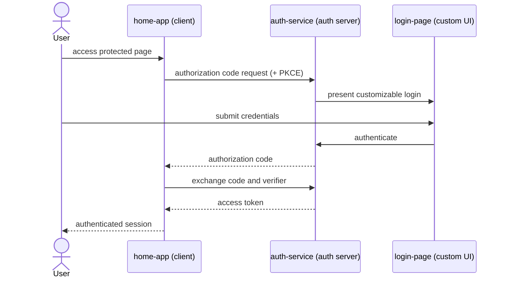

# oauth2-spring-boot-3

OAuth 2.1 authorization-code flow with the Spring Authorization Server on Spring
Boot 3, centred on a customizable login page — the pattern for migrating a legacy
custom password-grant flow to the authorization-code flow. No resource server in
this scenario.

## Modules

| Module | Stack | Role |
|---|---|---|
| `auth-service` | Java 24, Maven, Spring Authorization Server; MySQL via `spring-boot-docker-compose` | Authorization server; renders the custom login |
| `home-app` | Next.js + TypeScript (pnpm) | Client application |
| `login-page` | React + JavaScript, Vite (pnpm) | Customizable login UI |

## Getting started

MySQL is started automatically by `spring-boot-docker-compose` when the
auth-service runs — no manual `docker compose up` needed.

```bash
cd auth-service && ./mvnw spring-boot:run      # starts MySQL + the authorization server
cd login-page   && pnpm install && pnpm dev
cd home-app     && pnpm install && pnpm dev
```

## Flow


