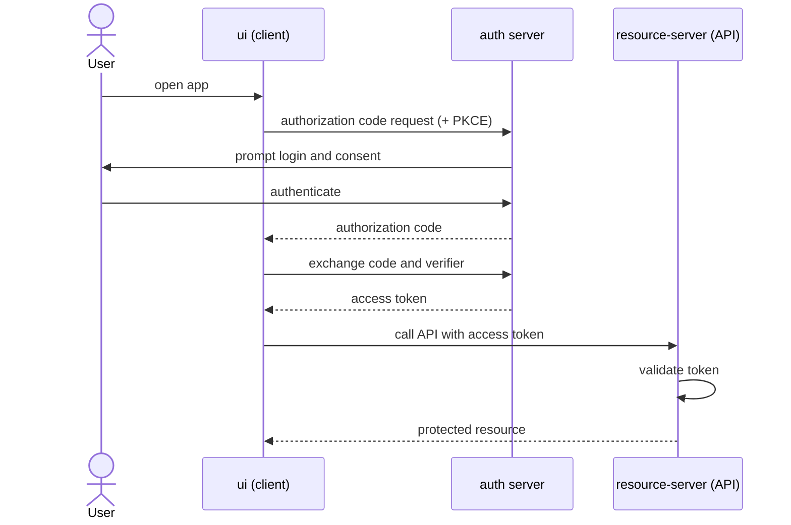

# oauth2-spring-boot-4

The OAuth 2.1 authorization-code flow upgraded to Spring Boot 4, adding a resource
server that validates access tokens.

## Modules

| Module | Stack | Role |
|---|---|---|
| `auth-service` | Java 25, Maven, Spring Authorization Server; embedded H2 | Issues and signs access tokens |
| `resource-server` | Java 25, Maven | Protected API validating access tokens |
| `ui` | React + TypeScript, Vite (pnpm) | Client application |

## Getting started

Uses embedded H2 - no external services required.

```bash
cd auth-service    && ./mvnw spring-boot:run
cd resource-server && ./mvnw spring-boot:run
cd ui              && pnpm install && pnpm dev
```

## Flow


