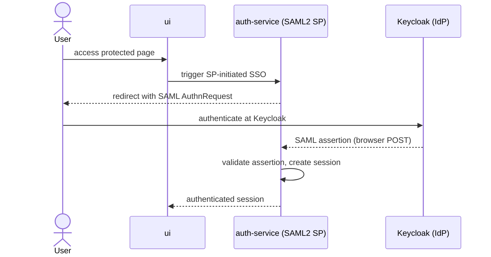

# saml2-spring-boot-3

SAML2 SP-initiated single sign-on with Spring Security as the service provider and
**Keycloak** as the identity provider, on Spring Boot 3.

## Modules

| Module | Stack | Role |
|---|---|---|
| `auth-service` | Java 24, Maven, Spring Security SAML2; MySQL + Keycloak (`compose.yml`) | SAML2 service provider |
| `ui` | React + TypeScript, Vite (pnpm) | Front end protected by single sign-on |

## Getting started

Bring up MySQL and Keycloak from the provided `compose.yml` first.

```bash
docker compose up -d          # starts MySQL + Keycloak
cd auth-service && ./mvnw spring-boot:run
cd ../ui        && pnpm install && pnpm dev
```

## Flow


